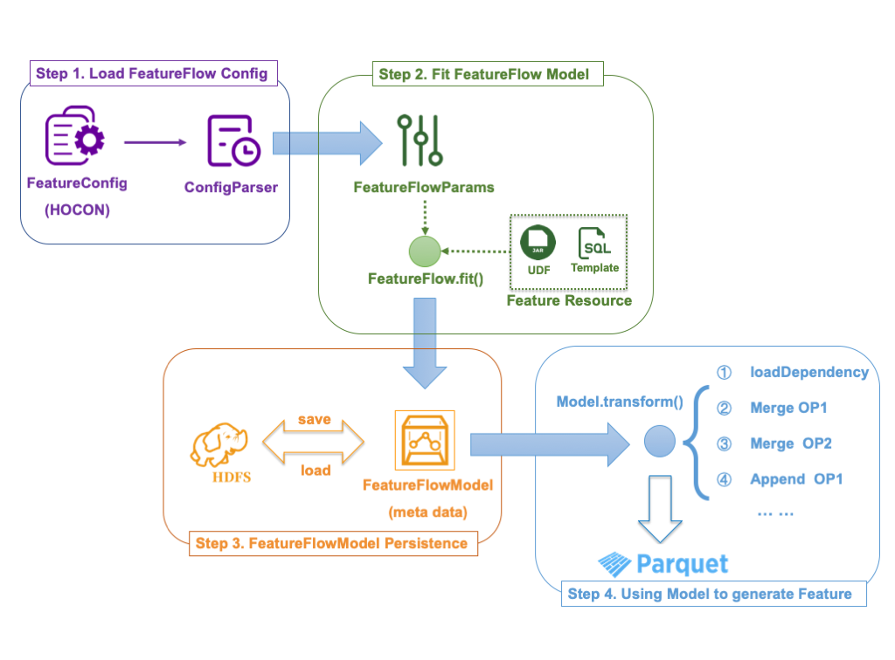

# 项目概述

dmflow是一个开源版的Spark平台机器学习模型特征合并工具，旨在简化离线集群中多数据源的特征合并工作

用户通过编写特征配置文件，指定不同数据源的依赖方式和合并方式，由工具自动完成特征的合并处理过程

# 功能支持

**纯配置驱动**：基于HOCON配置文件描述特征合并过程，可以覆盖生产环境中绝大部分的处理流程，`无需编码`即可轻松完成特征合并处理

**灵活的上游依赖**：支持按 `_SUCCESS`、`capacity`、`count` 等不同方式，检测上游依赖特征数据源是否已存在，同时支持对数据源进行降级处理

**特征模型持久化**：对于已执行通过的特征配置文件及其依赖的资源文件，可直接以元模型的形式存储在HDFS上，便于特征版本管理，同时简化了特征例行化过程

**最佳实践**：融入滴滴用户画像团队日常特征产出过程的最佳实践，有效避免：上游特征缺失、主键重复、数据倾斜等问题

**可扩展性**：预留UDF特征接口，方便接入自定义的特征生成逻辑

# 如何使用

**构建**
``` bash
git clone https://github.com/didi/dlflow.git && cd dmflow && mvn package

# using shaded jar
mkdir bin && cp target/dmflow-1.0.0-SNAPSHOT.jar bin/ 
```

**编写配置项**
``` bash
# 编写特征合并流程的配置（HOCON格式）
cp example/FeatureFlow.conf bin/MyFeatureFlow.conf
vi bin/MyFeatureFlow.conf

# 若特征依赖SQL等外部资源，请对应添加
vi bin/my_feature.sql
```

配置项说明详见 [FeatureFlow Config](FeatureFlowConfig.md)

**执行SparkJob**
``` bash

YARN_QUEUE="root.my_yarn_queue"

JAR="dmflow-1.0.0-SNAPSHOT.jar"

# 合并特征的种子人群提取SQL
trainSeedSQL="select id,label from db.table where dt='2020-03-09'"

# 特征合并流程的配置文件
featureConfig="MyFeatureFlow.conf"

# 特征合并的日期（决定上游数据提取的基准日期，可选格式：YYYYMMSS, YYYY-MM-DD, YYYY-MM-DD）
featureDate="20200309" 

# HDFS 工作目录前缀
YOUR_HDFS_PREFIX="XXXX"

# 特征合并流程模型保持地址
featureModelHDFS="${YOUR_HDFS_PREFIX}/model/${featureDate}"

# 合并后的特征产出地址
trainFeatureHDFS="${YOUR_HDFS_PREFIX}/train/feature/${featureDate}"

cd bin/

# 基于训练批次日期的数据，生成FeatureFlowModel，存于HDFS上
spark-submit  --queue ${YARN_QUEUE}  \
        --class com.didi.dm.dmflow.FeatureFlowRunner  \
        --name "dmflow"  \
        --driver-memory 2g  \
        --executor-memory 12g \
        --conf "spark.dynamicAllocation.enabled=true" \
        --conf "spark.driver.maxResultSize=1g" \
        --conf "spark.dynamicAllocation.minExecutors=100" \
        --conf "spark.dynamicAllocation.maxExecutors=300" \
        --conf "spark.yarn.executor.memoryOverhead=3g" \
        --conf "spark.sql.shuffle.partitions=1000" \
        --conf "spark.default.parallelism=1000" \
        --conf "spark.executor.cores=2" \
        --driver-java-options "-Dlog4j.configuration=file:log4j.properties" \
        ${JAR}  \
        --seedSQL "${trainSeedSQL}" \
        --featureConfig "${featureConfig}" \
        --featureDate "${featureDate}" \
        --featureModelHDFS "${featureModelHDFS}" \
        --featureOutHDFS "${trainFeatureHDFS}" \
        --fit true


# 预测批次的数据
predictSeedSQL="select id,label from db.table where dt='2020-03-10'"
predictDate="20200310"
predictFeatureHDFS="${YOUR_HDFS_PREFIX}/predict/feature/${predictDate}"

# 读取已经存在的特征模型，生成新批次的特征
spark-submit  --queue ${YARN_QUEUE}  \
        --class com.didi.dm.dmflow.FeatureFlowRunner  \
        --name "dmflow"  \
        --driver-memory 2g  \
        --executor-memory 12g \
        --conf "spark.dynamicAllocation.enabled=true" \
        --conf "spark.driver.maxResultSize=1g" \
        --conf "spark.dynamicAllocation.minExecutors=100" \
        --conf "spark.dynamicAllocation.maxExecutors=300" \
        --conf "spark.yarn.executor.memoryOverhead=3g" \
        --conf "spark.sql.shuffle.partitions=1000" \
        --conf "spark.default.parallelism=1000" \
        --conf "spark.executor.cores=2" \
        --driver-java-options "-Dlog4j.configuration=file:log4j.properties" \
        ${JAR}  \
        --seedSQL "${predictSeedSQL}" \
        --featureDate "${predictDate}" \
        --featureModelHDFS "${featureModelHDFS}" \
        --featureOutHDFS "${predictFeatureHDFS}" \
        --fit false
```

# 技术方案



# 开发指南

* 示例项目 [Demo](example/run_spark.py)
* 访问 [core library source code](src/main/scala/com/didi/dm/dmflow)
* 访问 [Release notes](RELEASE-NOTES.md)


# 参与项目

欢迎使用并参与到本项目的建设中，详细参见 [Contributing Guide](CONTRIBUTING.md)

# LICENSE

dmflow 基于 Apache-2.0 协议进行分发和使用，更多信息参见 [LICENSE](LICENSE)