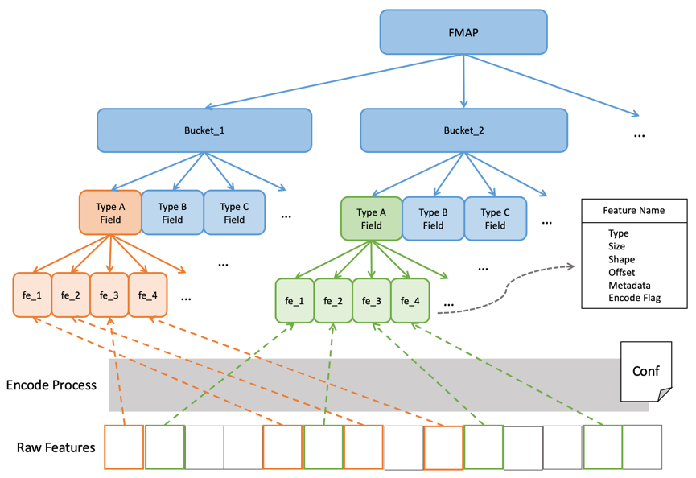

# Fmap

通常，用户无需关心Fmap的生成，因为这一步在特征处理任务中已经自动完成，用户只需关心如何使用Fmap。


### Fmap介绍



Fmap是一个树形的特征特征映射结构，它记录了特征和特征编码相关信息。

DLFlow中特征按照桶(Bucket)进行分装，桶下又划分为类型域(Field)，特征(Feature)最终被装进每个域中。

Bucket对特征进行逻辑上的分组，Field在Bucket的基础上按照特征类型进行分组。分组的目的是便于特征的组织，DLFlow对特征进行编码也操作也是在Bucket级别上进行的。
    
为了便于说明，这里假定分桶配置信息如下：
```hocon
bucket_1: {
    features: [
        "feature_f1_1",
        "feature_f1_2"
    ],
    is_encode: true,
    method: "pnorm",
    param: {"p": 1.0}
}

bucket_2: {
    features: [
        "feature_f2_1",
        "feature_f2_2"
    ],
    is_encode: false
}
```

### 加载Fmap

使用Fmap需要先倒入相应模块
```python
from dlflow.features import Fmap
```

通过保存Fmap的目录加载Fmap
```python
fmap = Fmap.load("<LOCAL_FMAP_DIR>")

print(fmap)
# <dlflow.features.feature_base.Fmap at 0x7ff29d9437d0>
```

### 获取Bucket对象

```python
fmap.get_buckets()

# [<dlflow.features.feature_base.FeBucket at 0x7ff1fe70e710>,
#  <dlflow.features.feature_base.FeBucket at 0x7ff1fe720e50>]


for bucket_name, bucket in fmap:
    print(bucket_name, bucket)
    
# bucket_1 <dlflow.features.feature_base.FeBucket object at 0x7ff1fe70e710>
# bucket_2 <dlflow.features.feature_base.FeBucket object at 0x7ff1fe720e50>


# 获取具体Bucket对象
fmap.bucket_2
fmap["bucket_2"]
```

### 获取Field对象

```python
bucket = fmap.bucket_1

bucket.get_buckets()

# [<dlflow.features.feature_base.FeField at 0x7ff1fe720e90>,
#  <dlflow.features.feature_base.FeField at 0x7ff1fe720fd0>]


for field_name, field in bucket:
    print(field_name, field)
    
# nums <dlflow.features.feature_base.FeField object at 0x7ff1fe720e90>
# ctgs <dlflow.features.feature_base.FeField object at 0x7ff1fe720fd0>


# 获取具体的Bucket对象
nums = bucket.nums
ctgs = bucket["ctgs"]
```

### 获取特征对象

Fmap，Bucket和Field对象都支持 `get_features()` 方法，其返回值是一个有序的特征列表。
```python
features = nums.get_features()

for fe in features:
    print(fe.name, fe)
    break
    
# feature_1, <dlflow.features.feature_base.Feature object at 0x7ff1fe720f10>


fe.to_dict()

# OrderedDict([('fetype', 'FeFloat'),
#              ('size', 1),
#              ('shape', None),
#              ('offset', 0),
#              ('meta', None),
#              ('flag', True)])
```

对具体某个原始特征进行编码操作后，会生成相应的编码信息，这些信息都被记录在了Feature对象中，包括：

- `fe.name` 特征名
- `fe.fetype` 特征类型
- `fe.size` 占位长度
- `fe.shape` 维度形状
- `fe.offset` 桶内偏移量
- `fe.meta` 编码信息
- `fe.flag` 编码标识
